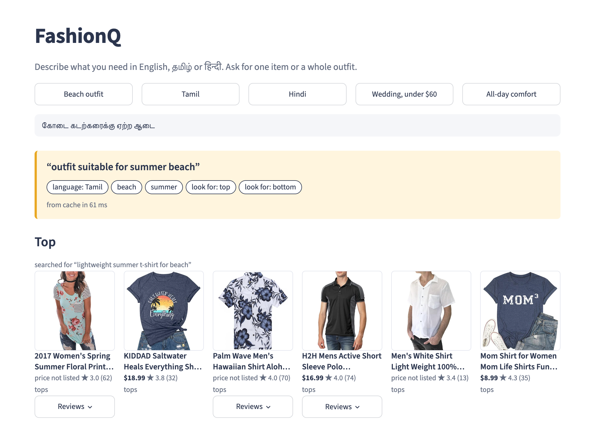
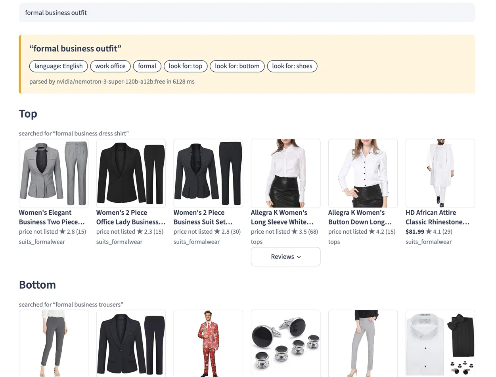
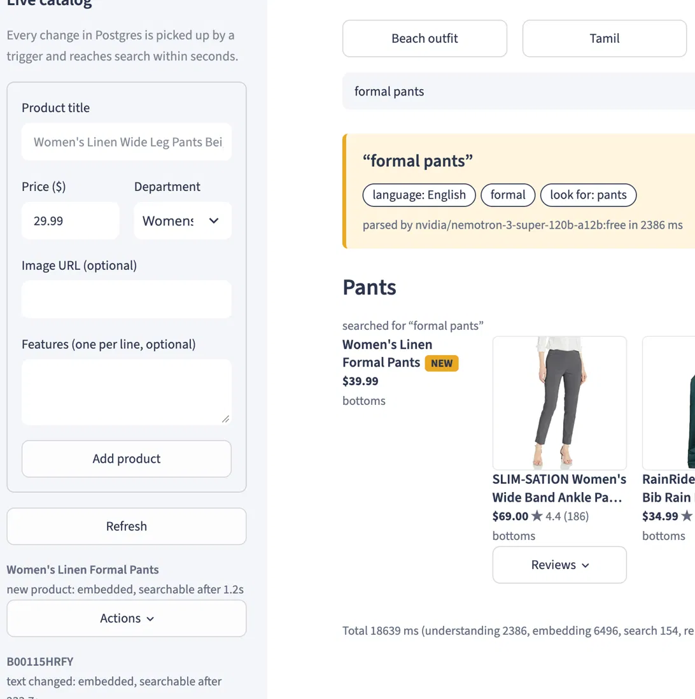
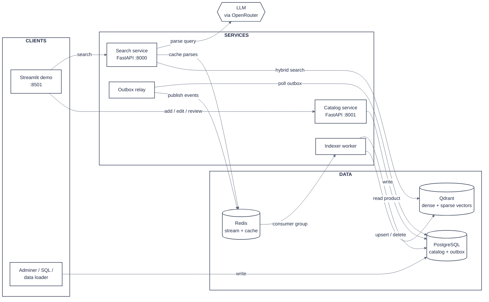
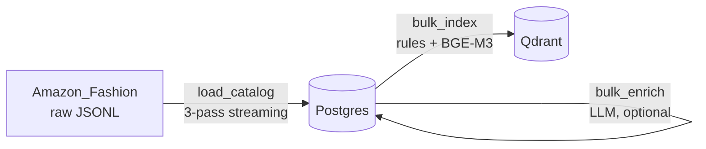
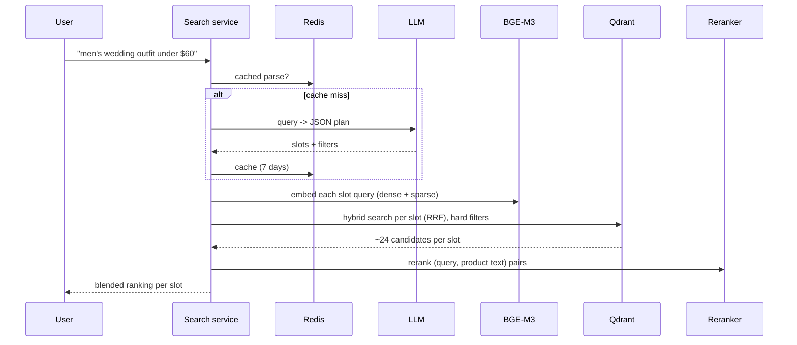

# FashionQ: multilingual semantic fashion search with a live catalog

Ask for clothes the way you'd ask a friend, in English, தமிழ் or हिन्दी: *"outfit for the beach this summer"*, *"सर्दियों के लिए गर्म जैकेट"*, *"men's wedding outfit under $60"*. FashionQ understands the request with an LLM, splits outfits into pieces, retrieves products with hybrid semantic search, reranks them with a cross-encoder, and keeps the index in sync with the catalog in near real time through Postgres change-data-capture.

Built on 25,000 real products from the **Amazon Reviews 2023 (McAuley Lab) Amazon_Fashion** dataset.


| Multilingual query |  Outfit based query | Live catalog |
|---|---|---|
|  |  |  |

---

## Highlights

- **Multilingual understanding.** Queries in English, Tamil and Hindi reach the same quality: **100% multilingual parity** in our evaluation.
- **Outfit-aware search.** "Beach outfit" becomes separate searches for a top, a bottom and footwear, each with its own filters.
- **Hybrid retrieval + reranking.** BGE-M3 dense and sparse vectors fused with RRF, then re-scored by a multilingual cross-encoder, then blended with a Bayesian rating.
- **Hard constraints that hold.** "Under $30" and "for women" become real filters: **100% constraint accuracy** vs 88% for plain embedding search.
- **Evolving catalog.** Any change in Postgres (API, loader, Adminer, plain SQL) is captured by triggers and reaches search in about a second. Each kind of change costs only what it needs: new products are embedded, price changes and new reviews are payload-only updates.
- **Graceful degradation.** A 3-model LLM fallback chain, Redis caching of parsed queries, and plain hybrid search if every LLM is down. The demo never breaks because of an LLM.

---

## Architecture



Postgres triggers write every catalog change into an outbox table in the same transaction; the relay and the worker turn those rows into index updates (details in [technologies.md](technologies.md)).

**Four small services**, each with one job:

| Service | Job | Run with |
|---|---|---|
| Search service | Understand the query, retrieve, rerank, rank | `uvicorn services.search.api:app --port 8000` |
| Catalog service | The only API that changes products and reviews | `uvicorn services.catalog.api:app --port 8001` |
| Outbox relay | Moves change events from Postgres to a Redis Stream | `python -m services.catalog.outbox_relay` |
| Indexer worker | Keeps Qdrant in sync with catalog events | `python -m services.indexer.worker` |

---

## Data flow

### 1. Offline: building the catalog and the index



1. **Load.** `scripts/load_catalog.py` streams the dataset in three passes and keeps the 25,000 most-reviewed products, with review statistics (count, average, Bayesian rating, verified ratio, rating histogram) and the most helpful review samples.
2. **Enrich (optional).** `scripts/bulk_enrich.py` asks an LLM for structured attributes (category, gender, occasions, seasons, colors, materials, style, fit, keywords, review summary), validated against fixed vocabularies. About 2,200 products are LLM-enriched; all 25,000 get **rule-based enrichment** from titles and Amazon's Department field.
3. **Index.** `scripts/bulk_index.py` builds one text document per product, embeds it with BGE-M3 (dense and sparse) and upserts it to Qdrant with a payload for filtering and ranking. It is resumable and hash-based: unchanged products are skipped, and payload-only changes don't re-embed.

### 2. Online: answering a query



Example of the LLM's search plan:

```json
{
  "english": "outfit for a wedding for men under $60",
  "language": "en", "gender": "men", "max_price": 60,
  "occasions": ["wedding"],
  "slots": [
    {"name": "top",   "query": "men's formal dress shirt for a wedding", "category": "tops"},
    {"name": "bottom","query": "men's formal dress pants",               "category": "bottoms"},
    {"name": "shoes", "query": "men's leather dress shoes",              "category": "footwear"}
  ]
}
```

---

## Evaluation

`python -m eval.run_eval` runs **26 queries** (18 English, 4 Tamil, 4 Hindi; 5 needs are asked in several languages) through four variants, adding one component at a time (an ablation):

| Variant | P@5 | nDCG@10 | Constraint accuracy | Multilingual parity | Latency p50 / p90 |
|---|---|---|---|---|---|
| A. Dense only (BGE-M3) | 0.80 | 0.75 | 88% | 72% | 0.11 s / 0.14 s |
| B. Hybrid (dense + sparse, RRF) | 0.79 | 0.74 | 87% | 74% | 0.09 s / 0.10 s |
| C. Hybrid + cross-encoder rerank | 0.84 | 0.79 | 85% | 74% | 3.95 s / 4.64 s |
| **D. Full system (LLM + rules + rerank)** | **1.00** | **0.94** | **100%** | **100%** | 4.55 s / 7.51 s |

**Metrics**

- **P@5:** share of the top 5 results that are relevant (right category).
- **nDCG@10:** ranking quality with graded relevance (2 = right category *and* key attribute such as "winter", "running", "formal"; 1 = category only), against an ideal list of ten perfect results.
- **Constraint accuracy:** results obeying an explicit price or gender limit (items with unknown price or gender are skipped).
- **Multilingual parity:** Tamil/Hindi P@5 as a share of the same need's English P@5.
- **Latency:** time per query on a MacBook Air M2. Variant D's median uses cached LLM parses.

**What the numbers say**

- **BGE-M3 alone is a strong multilingual baseline** (P@5 0.80).
- **Sparse vectors add nothing on these descriptive queries.** They help exact terms (brands, sizes) that this query set barely contains, and they can't match Tamil/Hindi words against English titles. We keep hybrid for keyword-heavy queries, but this eval doesn't prove its value.
- **The reranker improves ranking** (nDCG 0.75 → 0.79).
- **LLM query understanding gives the largest jump.** Filters make every price and gender limit hold, and translating to a structured English plan makes Tamil and Hindi results as good as English.

**Latency breakdown** (median per query, uncached, MacBook Air M2)

- **LLM parse:** ≈ 2.4 s, and 0 ms when the query is cached in Redis
- **Embedding (BGE-M3):** ≈ 0.26 s
- **Qdrant hybrid search:** ≈ 0.02 s over 25,000 products
- **Rerank:** ≈ 4.5 s, the main cost
- **Reranker tuning:** going from 40 candidates × 512 tokens to 24 × 256 made it **2.7× faster at the same P@5 and nDCG**
- **Hardware limit:** on an M2 the cross-encoder costs about 70 ms per pair (fp16 gave no speed-up on MPS); on a server GPU this stage would take a fraction of a second

---

## Getting started

### Prerequisites

- macOS (Apple Silicon) or Linux; Python 3.12; Docker Desktop
- ~10 GB disk (models + data); 16 GB RAM recommended
- An OpenRouter API key (free tier works), or a local Ollama

### Setup

```bash
git clone https://github.com/dharshana-2107/fashionQ.git && cd fashionQ
python -m venv .venv && source .venv/bin/activate
pip install -r requirements.txt      # TODO: create with `pip freeze > requirements.txt`
cp .env.example .env                 # TODO: add .env.example (see below), then fill in your key
docker compose up -d                 # Postgres, Redis, Qdrant, Adminer

python -m scripts.check_setup
python -m scripts.download_models    # BGE-M3 + reranker into ./models_cache
python -m scripts.download_data      # Amazon_Fashion (McAuley Lab)
python -m scripts.load_catalog --n-products 25000
python -m scripts.bulk_enrich --limit 200   # optional, uses the LLM
python -m scripts.bulk_index
python -m scripts.install_triggers
```

`.env` example:

```env
LLM_BASE_URL=https://openrouter.ai/api/v1
LLM_API_KEY=sk-or-v1-...
LLM_MODEL=nvidia/nemotron-3-super-120b-a12b:free
LLM_TIMEOUT=60
LLM_JSON_MODE=true
LLM_REASONING_EFFORT=low
# Local alternative:
# LLM_BASE_URL=http://localhost:11434/v1
# LLM_API_KEY=ollama
# LLM_MODEL=qwen2.5:7b
```

### Run (five terminals, from the project root)

```bash
uvicorn services.search.api:app --port 8000
```
```bash
uvicorn services.catalog.api:app --port 8001
```
```bash
python -m services.catalog.outbox_relay
```
```bash
python -m services.indexer.worker
```
```bash
streamlit run demo/app.py
```

Open http://localhost:8501. API docs: http://localhost:8000/docs and http://localhost:8001/docs.

### Evaluate

```bash
python -m eval.run_eval                  # all variants -> eval/results.md
python -m eval.run_eval --variants A,B,C # no LLM calls
python -m eval.run_eval --only jacket_ta # one query in detail
```

---

## Project structure

```
fashionQ/
├── common/                 # shared building blocks
│   ├── config.py           # settings from .env
│   ├── db.py               # SQLAlchemy models + engine
│   ├── schemas.py          # attribute vocabularies + validation
│   ├── llm.py              # LLM client (retries, JSON parsing)
│   ├── embedder.py         # BGE-M3 dense + sparse
│   ├── vectorstore.py      # Qdrant: collections, alias, filters, hybrid search
│   ├── events.py           # Redis Streams helpers
│   ├── gpu.py              # one GPU lock per process (MPS is not thread-safe)
│   └── device.py           # cuda / mps / cpu selection
├── services/
│   ├── search/             # parser (LLM), pipeline, reranker, FastAPI app
│   ├── catalog/            # catalog FastAPI app, outbox relay
│   └── indexer/            # document builder, category + attribute rules, enrichment, worker
├── scripts/                # setup, data loading, enrichment, bulk indexing, triggers
├── eval/                   # queries.json, run_eval.py, results.md
├── demo/app.py             # Streamlit UI
├── .streamlit/config.toml  # light theme
└── docker-compose.yml
```

---

## Known limitations

- **Coverage.** About 9% of products are LLM-enriched; the rest rely on rules and embeddings, so occasion and season tags are thinner for them. Only 20% of products have a price.
- **Catalog gaps.** Even at 25,000 products, some needs (e.g. men's formalwear) have limited inventory.
- **Latency.** About 4.5 s per uncached search on a laptop, dominated by the cross-encoder.
- **Free-tier LLM.** Models can be busy or rate-limited; mitigated by the fallback chain, caching and plain-search fallback.
- **Simplifications.** No authentication on the catalog API; reviews update statistics but review text isn't stored yet; no MMR diversification.

## Path to production

- **Authentication and validation** on the catalog API; product sources become seller/admin UIs and supplier feeds calling the same endpoints.
- **LLM enrichment of new arrivals** in the worker, using a paid, reliable model (a few dollars per thousand products).
- **Latency:** the reranker on a GPU server or a distilled reranker, ONNX/quantization, and result caching for popular queries.
- **Scale:** several workers in the same consumer group, Kafka at very high volume, and monitoring and alerts on outbox backlog, stream lag and dead letters.
- **Quality:** human-labeled relevance judgments, click logs for learning-to-rank, and MMR for diversity.
- **Zero-downtime model changes:** build `products_<model>_v2` beside v1 and switch the `products` alias.

## Acknowledgements

- Dataset: *Amazon Reviews 2023*, McAuley Lab, UC San Diego: Hou et al., "Bridging Language and Items for Retrieval and Recommendation" (2024).
- Models: BAAI BGE-M3 and bge-reranker-v2-m3; NVIDIA Nemotron; Alibaba Qwen.
- Infrastructure: Qdrant, PostgreSQL, Redis, FastAPI, Streamlit.


---

## More technical details

The design is documented in **[technologies.md](technologies.md)**:

- **Tech stack:** every component and what it's used for
- **Models:** which models were chosen, and why
- **Evolving catalog:** Postgres triggers, the outbox, Redis Streams, and how each kind of change is handled
- **Ranking:** the scoring formula, filters and fallbacks
- **Features:** both APIs and the demo page
- **Lessons learned:** design decisions driven by what the data showed
