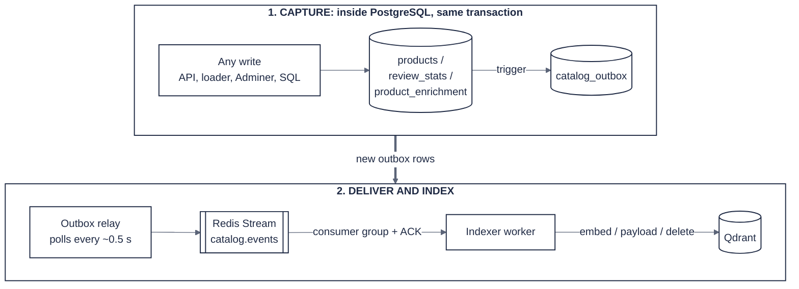

# FashionQ: technologies and design

The technical companion to the [README](README.md): what FashionQ is built with, which models it uses and why, how the catalog stays in sync with search, how results are ranked, what the services offer, and what we learned along the way.

**Contents:** [Tech stack](#tech-stack) · [Models](#models-what-and-why) · [Evolving catalog](#evolving-catalog-keeping-search-in-sync-cdc) · [Ranking](#ranking) · [Features](#features) · [Lessons learned](#lessons-learned-design-decisions-driven-by-data)

---

## Tech stack

| Layer | Technology |
|---|---|
| Language | Python 3.12 |
| APIs | FastAPI + Uvicorn |
| Demo UI | Streamlit |
| Vector database | Qdrant (named dense + sparse vectors, payload indexes, server-side RRF, versioned collections behind an alias) |
| Relational database | PostgreSQL 16 (JSONB, PL/pgSQL triggers, transactional outbox) |
| Events and cache | Redis 7 (Streams with consumer groups, AOF persistence, parse cache) |
| ML | PyTorch (Apple MPS), FlagEmbedding, Hugging Face models |
| LLM access | OpenAI-compatible SDK → OpenRouter (cloud) or Ollama (local) |
| Data access | SQLAlchemy 2.0, pydantic / pydantic-settings |
| Infra | Docker Compose (Postgres, Redis, Qdrant, Adminer) |

---

## Models: what and why

| Model | Role | Why this one |
|---|---|---|
| **BAAI/bge-m3** | Product and query embeddings | One model gives **both** dense vectors (meaning, 1024-dim) and sparse lexical weights (exact words) in a single pass. Strong multilingual quality across 100+ languages, so Tamil and Hindi queries match English product text without a translation step. Runs locally on an M2 GPU. |
| **BAAI/bge-reranker-v2-m3** | Cross-encoder reranking of the top candidates | Reads query and product **together**, which is much sharper than comparing two separate vectors. It is multilingual like BGE-M3. Used only on ~24 candidates per slot to bound cost. |
| **NVIDIA Nemotron 3 Super 120B** (OpenRouter, free tier) | Query understanding: translation, outfit slots, filters as JSON | Large enough to follow a JSON schema reliably and handle Tamil/Hindi. Requests go through an automatic fallback list of free models, so a busy model is invisible to users; parsed queries are cached in Redis, so a repeated query costs nothing. |
| **Qwen 2.5 3B / 7B** (Ollama, local) | Batch product enrichment (Phase 2) | Free, local, no rate limits. Its systematic errors (see *Lessons learned*) led to the rule layer below. |

**Why not one big LLM for everything?** Embedding search is fast and cheap per query; the LLM is used once per *new* query (then cached), never per product at search time.

---

## Evolving catalog: keeping search in sync (CDC)



Row 1 happens inside the database: a trigger records each change in `catalog_outbox` as part of the same transaction. Row 2 runs outside it: the relay publishes new outbox rows to a Redis Stream, and the indexer worker applies them to Qdrant.

Postgres triggers classify every change, and the worker does only the work each change needs:

| Change | Event | Worker action | Typical time to search |
|---|---|---|---|
| New product | `product.created` | rules → embed → index, NEW badge | ~1 s |
| Title / features / description edited | `product.updated` | re-embed | ~1 s |
| LLM enrichment saved | `product.enriched` | re-embed (tags + summary) | ~1 s |
| Price / image / details changed | `product.changed` | payload-only update, no embedding | < 1 s |
| New review | `product.reviewed` | payload-only: count, average, Bayesian rating | < 1 s |
| Deactivated or deleted | `product.deactivated` | remove from index | < 1 s |

**Reliability:**

- **Outbox pattern.** Events are written in the same transaction as the change, so nothing is lost if Redis, the relay or the worker is down. Events wait and are processed later; we tested 20 bulk inserts while the relay was stopped.
- **Consumer groups with acknowledgements.** An event a worker grabbed before crashing is re-processed on restart.
- **Dead-letter queue.** An event that fails 3 times goes to `catalog.dlq` instead of blocking the stream.
- **No event storms.** Identical rewrites (e.g. re-running the loader) produce no events.
- **Safety net.** If a "cheap" event arrives but the product text actually changed, the worker re-embeds anyway.

---

## Ranking

For each outfit slot, candidates come from Qdrant hybrid search (dense + sparse, fused with Reciprocal Rank Fusion) under hard filters, then:

```
final = 0.80 × relevance            (reranker score; normalized hybrid score if reranking is off)
      + 0.15 × rating               (Bayesian rating, prior weight 20 at the global mean 4.06)
      + up to 0.12 tag boosts       (matching occasion / season / color)
      + 0.10 formal | −0.25 casual  (only for formal / office / wedding queries)
      + 0.06 own-category bonus     (shirts before suits in a "top" slot)
      + 0.03 new-arrival boost
      − 0.05 if a price was requested but the item has none
```

Plus a few rules:

- **Filters.** Gender `men`/`women` includes unisex. Kids' items are excluded unless the query mentions kids. Items **without** a price stay in price-filtered results (only 20% of products have a price), ranked slightly lower.
- **Related categories.** A "tops" slot also searches outerwear and suits, so blazers aren't lost to labeling.
- **Filter relaxation.** If a slot finds too few items, category and then gender filters are loosened, keeping the strict results first.
- **Deduplication.** Near-identical titles (size/color variants) are removed.

---

## Features

**Search service** (`:8000`, interactive docs at `/docs`)

- `GET /search?q=...&k=6&llm=true&rerank=true`: results grouped by outfit slot, with the parsed plan and per-stage timings
- `GET /health`: indexed product count and active LLM

**Catalog service** (`:8001`)

- `POST /products`: add a product (auto-generated ID if omitted)
- `PATCH /products/{asin}`: partial update (a price-only change triggers no re-embedding)
- `POST /products/{asin}/reviews`: add a review; updates count, average and Bayesian rating incrementally
- `POST /products/{asin}/deactivate`: remove from the store
- `GET /products/{asin}`, `GET /recent`, `GET /stats` (outbox backlog, queue, dead letters, trigger check)

```bash
curl -X POST localhost:8001/products -H 'content-type: application/json' \
  -d '{"title":"Women'"'"'s Silk Saree Blouse Festive Wedding Wear Maroon","price":45,"details":{"Department":"Womens"}}'
curl -X POST localhost:8001/products/<ASIN>/reviews -H 'content-type: application/json' -d '{"rating":5}'
```

**Demo page** (`:8501`)

- **Search:** one-click examples in English, Tamil and Hindi, plus toggles for LLM parsing and reranking.
- **"What the search understood" panel:** the translation, filters, slots, which model parsed the query and how long it took.
- **Results:** grouped by slot, with image, price, rating and category, a review-summary popover, and a NEW badge.
- **Live catalog sidebar:** an add-product form and a live event feed ("embedded, searchable after 1.2 s" / "updated, no re-embedding"). Each event has actions: Find in search, add a 5★ or 1★ review, price −10%, remove.

---

## Lessons learned (design decisions driven by data)

1. **A small LLM made systematic labeling errors.** qwen2.5:3b filed over 1,000 products under "accessories" and labeled cardigans, gloves and beanies as "footwear". → We added a deterministic **rule layer** that derives categories and attributes from titles; it overrides the LLM where the title is explicit.
2. **The catalog, not the search, was the problem.** "Formal meeting outfit" returned t-shirts because the top 5,000 most-reviewed products contained no dress shirts or trousers at all (the best match was a fake collar). → We expanded to 25,000 products (138 formal items), indexed without LLM enrichment.
3. **Labels must agree across components.** The LLM put blazers in "tops" while the rules put them in "suits_formalwear", which silently hid every blazer. → Slots search **related categories**.
4. **Words are ambiguous.** "Tuxedo shirt" is a top, "beekeeping suit" isn't a suit, "dress tuxedo vest" isn't a dress. → Rules are tested against real titles; the item noun decides.
5. **Infrastructure defaults bite.** redis-py 8's 5-second default socket timeout equaled the worker's blocking read and crashed it. PyTorch MPS crashes when two threads use the GPU at once. → A longer timeout plus reconnect logic, and one shared GPU lock per process (tested with 24 concurrent searches).
6. **An evolving catalog should be event-driven at the source.** A first version simulated "new arrivals" from a held-back set. → Replaced by **Postgres triggers + a transactional outbox**, so every write path is captured and different changes cost different amounts of work.

---

← Back to the [README](README.md)
